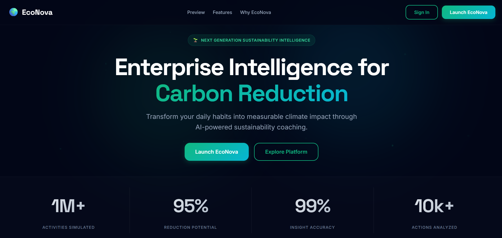
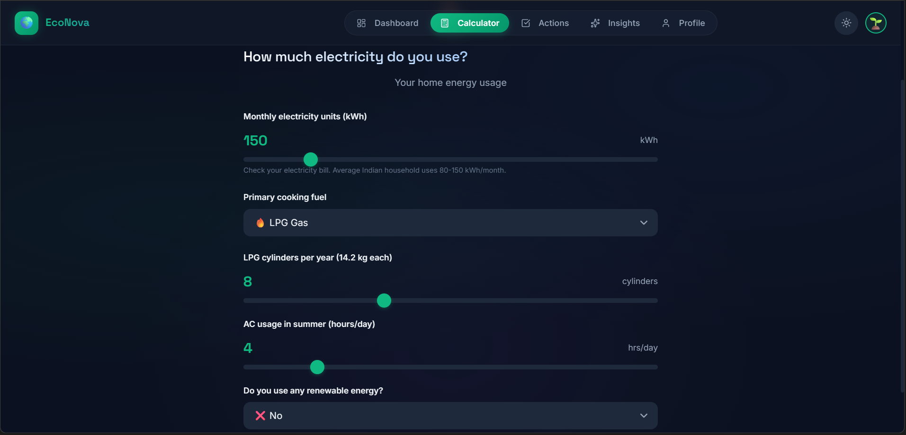
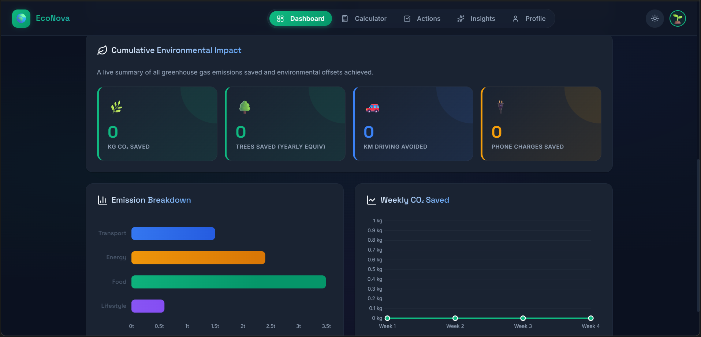
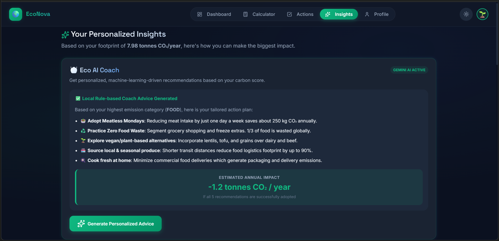
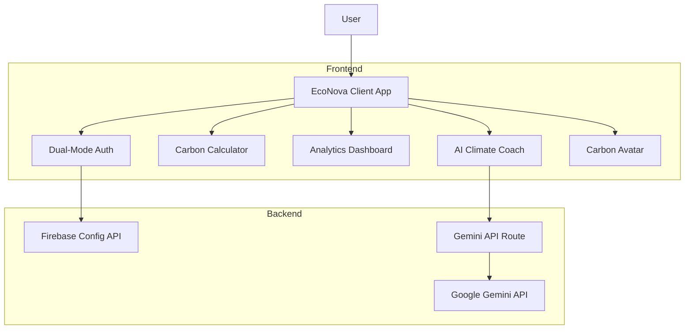

<div align="center">

# 🌍 EcoNova

### AI-Powered Sustainability Intelligence Platform

**EcoNova helps individuals understand, track, and reduce their carbon footprint through AI-powered sustainability insights, habit-building systems, and personalized climate intelligence.**

[](https://eco-nova23.vercel.app/)
[](https://github.com/anuragak-23/EcoNova)

<br/>

[](#)

[](#)

</div>

---

## 📱 Product Preview

Here is a preview of the EcoNova interface in action:

| **Landing Page** | **Carbon Calculator** |
|:---:|:---:|
|  |  |

| **Dashboard** | **AI Climate Coach** |
|:---:|:---:|
|  |  |


---

## 🎯 The Problem

Climate change is one of the most pressing challenges facing our generation. While many people want to live more sustainably, they often struggle to understand:

*   **Emissions baseline**: How much carbon they actually emit through their daily routines.
*   **Highest contributors**: Which specific daily activities contribute the most to their footprint.
*   **High-impact actions**: What exact actions will have the biggest and most immediate positive impact.
*   **Motivation**: How to stay motivated and build consistent, eco-friendly habits over time.

Most traditional carbon calculators provide a single number and stop there. They create awareness but fail to drive meaningful behavior change. As a result, users remain **informed but not empowered**.

---

## 💡 Our Solution

EcoNova is an AI-powered sustainability platform designed to transform carbon awareness into measurable action. Instead of simply calculating emissions, EcoNova helps users:

*   **Understand**: Get an accurate breakdown of emissions across key life categories.
*   **Target**: Receive personalized AI recommendations tailored to their footprint profile.
*   **Act**: Build sustainable daily habits by logging check-ins.
*   **Monitor**: Track long-term progress with real-time carbon reduction metrics.
*   **Engage**: Stay motivated through gamification, streak counts, and milestone achievements.

The platform combines climate intelligence, behavioral design, and data visualization to help users make smarter environmental decisions every day.

### From Awareness to Action

Most existing tools focus solely on measurement. EcoNova is designed to guide users through the entire behavioral change funnel:

$$\text{Measurement} \longrightarrow \text{Understanding} \longrightarrow \text{Action} \longrightarrow \text{Habit Formation} \longrightarrow \text{Long-Term Impact}$$

---

## 💡 Why EcoNova?

Climate change is one of the defining challenges of our generation. 

While most carbon calculators provide information, they rarely help users build sustainable habits. They tell you your score, but leave you feeling overwhelmed and unmotivated to change.

**EcoNova was created to bridge the gap between awareness and action.** We turn passive data into active habits, helping you make sustainable choices every day.

---

## ⚡ What Makes EcoNova Different?

EcoNova redesigns carbon accounting from the ground up, contrasting traditional static tools with a dynamic, habit-forming experience:

| **Traditional Carbon Calculators** | **EcoNova** |
| :--- | :--- |
|  **Static calculations** done once a year | 🔄 **Dynamic tracking** that updates in real time |
|  **Generic recommendations** list | 🤖 **AI Sustainability Coach** with tailored advice |
|  **No engagement** or incentive | 🏆 **Gamified progression** with points & streaks |
|  **Awareness only** | 🌱 **Habit formation** built around loggable actions |

---

## ✨ Key Features

<div align="center">

### 🤖 AI Sustainability Coach
Receive personalized recommendations and real-time carbon-reduction strategies powered by Google Gemini.

### 📊 Carbon Analytics Dashboard
Visualize your emissions breakdown and track savings trends over time using interactive Chart.js widgets.

### 🧮 Carbon Footprint Calculator
Assess your emissions across transportation, energy, food, and lifestyle in under 3 minutes.

### 🌱 Climate Profile
Track your sustainability journey, monitor your Evolving Carbon Avatar rank, and showcase your carbon rank.

### 🏆 Gamification
Stay motivated with achievements, daily logging streaks (with audio celebrations), levels, and points rewards.

### 📈 Progress Tracking
Monitor long-term environmental impacts and visualize 10-year emissions projections.

</div>

---

## 🔄 How EcoNova Works

EcoNova is built around a continuous cycle of carbon reduction and behavioral science:

```
[ Step 1: Calculate Footprint ] 
              │
              ▼
[ Step 2: Get AI Coach Insights ] 
              │
              ▼
[ Step 3: Take Eco-Friendly Actions ] 
              │
              ▼
[ Step 4: Build Daily Log Streaks ] 
              │
              ▼
[ Step 5: Track Long-Term Progress ]
```

---

## 🌍 Impact Vision

Individual actions, when scaled, can change the planet. 

> [!IMPORTANT]
> If **one million users** reduce their carbon footprint by **only 10%** using EcoNova, the collective impact could save **millions of tonnes of CO₂ annually**—equivalent to taking hundreds of thousands of internal combustion engine vehicles off the road.
> 
> We believe in the power of collective micro-actions to drive massive global impact.

---


## 🛠️ Technology Stack

*   **Frontend**: HTML5, Vanilla CSS3 (Custom properties/transitions), ES6+ JavaScript.
*   **AI**: Google Gemini 1.5 Flash (via secure backend REST endpoints).
*   **Authentication**: Firebase Authentication with dynamic demo fallback.
*   **Visualization**: Chart.js (custom gradients & animated trend lines).
*   **Deployment**: Vercel (Static hosting + Node.js Serverless Functions).
*   **Storage**: LocalStorage API for offline persistence and session state.

---

## ⚙️ System Architecture

EcoNova is engineered as a secure, fast, and modern static application powered by Serverless backend routes:


---

## 🚀 Getting Started

### Local Setup

1. **Clone the repository**:
   ```bash
   git clone https://github.com/anuragak-23/EcoNova.git
   cd EcoNova
   ```
2. **Configure environment variables**: Copy `.env.local.example` to `.env.local` and add your `GEMINI_API_KEY` (and optional Firebase credentials).
3. **Run a local server**:
   ```bash
   python -m http.server 8000
   ```

### Vercel Deployment

1. **Import project**: Connect your GitHub repository to [Vercel](https://vercel.com).
2. **Configure environment variables**: Add your `GEMINI_API_KEY` in Vercel's **Environment Variables** settings.
3. **Deploy**: Click **Deploy** to automatically build and launch the static client and serverless API endpoints.

---

## 🔮 Roadmap

### Near-Term
*   👥 **Community Challenges**: Launch collaborative group challenges.
*   🧠 **Advanced AI Insights**: Multi-variable prompt personalization.
*   🔮 **Carbon Forecasting**: Future emission scenarios modeling.

### Long-Term
*   🔌 **Smart Meter Integration**: Auto-sync utility consumption.
*   📡 **IoT Sustainability Tracking**: Real-time smart plug load measurements.
*   📱 **Mobile App**: Native iOS/Android clients (PWA widgets).
*   🌱 **Carbon Offset Marketplace**: Link verified offsetting projects.

---


<div align="center">

### 🌍 Measure Better. Live Greener. Impact More.

*Turning carbon awareness into meaningful climate action.*

</div>


---
