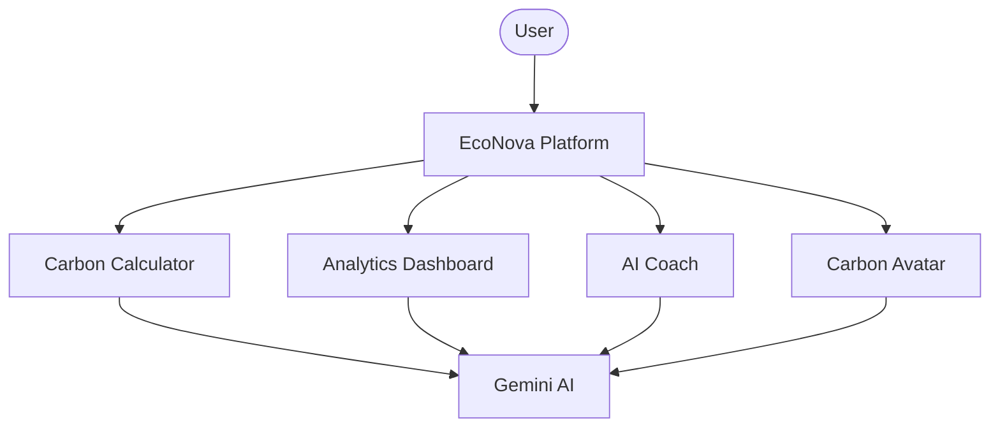

<div align="center">

# 🌍 EcoNova

### AI-Powered Sustainability Platform

Track, understand, and reduce your carbon footprint through AI-powered insights, sustainability tracking, and personalized climate coaching.

[](https://econova.vercel.app)
[](#)
[](#)
[](#hackathon-submission)

<br/>

[](#)
[](#)
[](#)
[](#)

</div>

---

## ⚡ Product Demo


*A walk-through of the onboarding wizard showing: Landing Page → Carbon Calculator → Dashboard → AI Coach → Results.*

---

## 📸 Screenshots

| Landing Page | Carbon Calculator |
| :---: | :---: |
|  |  |

| Dashboard | AI Coach |
| :---: | :---: |
|  |  |

| Climate Profile |
| :---: |
|  |

> [!NOTE]
> Contributors: Please place screenshots of the interface inside the `/screenshots` directory.

---

## 💡 Why EcoNova?

Most carbon calculators stop at **awareness**—they tell you your footprint score, but leave you feeling overwhelmed and unmotivated to change.

**EcoNova bridges the gap between awareness and sustained action:**

*   **Awareness**: Activity-based, multi-step carbon accounting gives you an accurate, personalized breakdown of your footprint.
*   **Action**: Directly log daily eco-actions (like cycling or reducing AC usage) to see your carbon savings in real time.
*   **Habit Building**: Dynamic logging streaks, XP progress bars, and audio celebrations gamify and reward eco-friendly habits.
*   **Long-Term Sustainability**: Evolve your personal Carbon Avatar rank as you lower emissions and build real climate accountability.

---

## ✨ Key Features

### 🤖 AI Sustainability Coach
Get personalized carbon-reduction plans securely generated by Gemini AI using your footprint profile.

### 📊 Carbon Analytics Dashboard
Monitor your emissions breakdown, daily eco tips, and weekly trends using interactive Chart.js visualizations.

### 🧮 Carbon Footprint Calculator
Assess your emissions across Transport, Energy, Food, and Lifestyle via a conversational onboarding questionnaire.

### 🌱 Carbon Avatar
Evolve your digital climate avatar rank dynamically as you log actions, lower emissions, and earn Eco-Points.

### 🏆 Gamification
Unlock achievements, build daily logging streaks with visual flames, and progress through carbon ranks.

### 📈 Progress Tracking
Project your carbon footprint over 1, 5, and 10 years, comparing current habits against a Gemini-recommended lifestyle.

---

## ⚙️ System Architecture



*An image-based architecture diagram will be placed here: ``*

---

## 🛠️ Tech Stack

*   **Frontend**: HTML5, Vanilla CSS3 (Custom properties/transitions), ES6+ JavaScript.
*   **AI**: Google Gemini 1.5 Flash (via secure backend REST endpoints).
*   **Authentication**: Firebase Authentication with dynamic demo fallback.
*   **Visualization**: Chart.js (custom gradients & animated trend lines).
*   **Deployment**: Vercel (Static hosting + Node.js Serverless Functions).
*   **Storage**: LocalStorage API for offline persistence and session state.

---

## 📐 Carbon Calculation Methodology

Emissions calculations utilize activity-based emission factors from recognized scientific databases:

$$\text{Total Footprint (t CO}_{2}\text{e/year)} = \text{Transport} + \text{Energy} + \text{Food} + \text{Lifestyle}$$

*   **Transport**: Commute mode factors (petrol/electric/transit) $\times$ distance $\times$ frequency + domestic/international flights.
*   **Energy**: Monthly electricity bills $\times$ regional grid factor (e.g., $0.82\text{ kg CO}_2/\text{kWh}$ India grid average) + LPG/natural gas usage.
*   **Food**: Diet baseline (vegan/vegetarian/meat) adjusted for food waste % and local/imported sourcing.
*   **Lifestyle**: Clothing purchases, electronics habits, and shopping frequency multipliers.

---

## 💾 Core Data Model

### User Profile Schema
```javascript
{
  id: "uuid",
  name: "Eco Explorer",
  footprint: {
    total: 3.2,              // tonnes CO₂/year
    transport: 1.1,
    energy: 0.9,
    food: 0.7,
    lifestyle: 0.5,
    lastCalculated: "ISO-date"
  },
  level: 3,
  ecoPoints: 1240,
  streak: 7,
  badges: ["calculator-completed", "streak-level-1"]
}
```

---

## 🚀 Deployment Guide

### Local Setup

1. Clone the repository:
   ```bash
   git clone https://github.com/anuragak-23/EcoNova.git
   cd EcoNova
   ```
2. Copy the environment variables template:
   ```bash
   cp .env.local.example .env.local
   ```
3. Set your variables in `.env.local` (e.g., your `GEMINI_API_KEY`).
4. Spin up a local static server to view:
   ```bash
   # Python
   python -m http.server 8000
   
   # Node/NPM
   npm install -g serve
   serve
   ```

### Environment Variables

Configure the following variables in Vercel or your local `.env.local` file:
*   `GEMINI_API_KEY`: Google Gemini API Key.
*   `FIREBASE_API_KEY` / `FIREBASE_PROJECT_ID` / `FIREBASE_APP_ID`: Firebase Web App credentials (optional).

### Vercel Deployment

1. Connect your GitHub repository to [Vercel](https://vercel.com).
2. Go to **Project Settings** -> **Environment Variables** and add `GEMINI_API_KEY`.
3. Click **Deploy**. Vercel will build the static client and host the serverless functions in `/api/` automatically.

---

## 🔮 Future Scope

*   **Smart Meter Integration**: Automatically pull utility data from home smart meters to compute electricity footprints.
*   **Carbon Offset Marketplace**: Enable users to invest their Eco-Points to support gold-standard verified carbon offset programs.
*   **Mobile Application**: Expand accessibility with push reminders and native mobile widgets for habit logging.
*   **Community Challenges**: Group challenges with friends and family to foster collective climate action.
*   **IoT Sustainability Tracking**: Connect smart plugs to track phantom appliance loads in real time.

---


**Built with 💚 for a greener planet**
